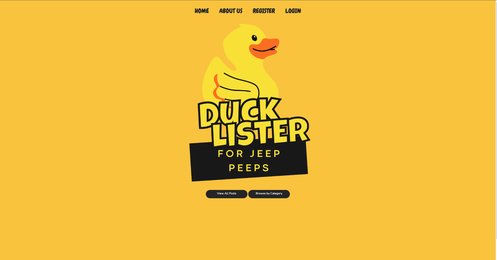

# ducklister
Ducklister is a Full Stack web application created for an online community for Jeep enthusiasts to celebrate the unique bond between Jeep owners and their rubber ducks. Users can create, read, update, and delete ads for rubber ducks. Users can also search for ads by title, view all ads, view all ads by category, view other users' profiles, edit their own profiles, and comment on ads.

### Screenshot

## Installation
1. Clone the repository
2. Create a MySQL database called `ducklister`
3. Run the SQL scripts `adlister_migration.sql` and `adlister_seeder.sql` to create the tables and seed the database
4. Run the application on a Tomcat server
5. Navigate to `localhost:8080/` in your browser
6. Enjoy!

## Features
* Users can create, read, update, and delete ads for rubber ducks
* Users can search for ads by title
* Users can view all ads
* Users can view all ads by category
* Users can view other users' profiles
* Users can edit their own profiles
* Users can comment on ads

## Technologies Used
* Java
* JSP
* Servlets
* MySQL
* Tomcat
* HTML
* CSS
* Bootstrap
* JavaScript
* MVC
* OOP

